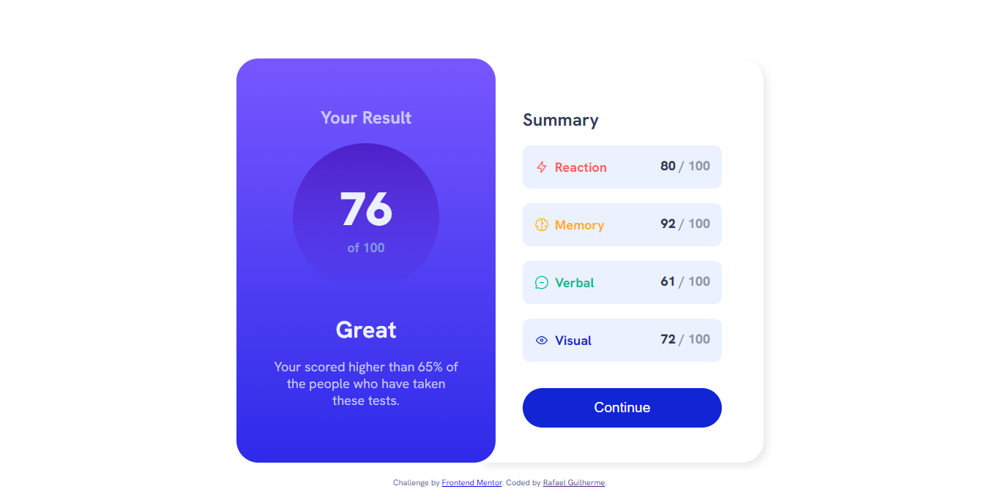
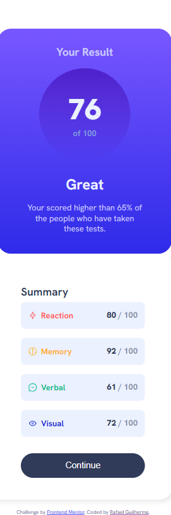

# Frontend Mentor - Results summary component solution

This is a solution to the [Results summary component challenge on Frontend Mentor](https://www.frontendmentor.io/challenges/results-summary-component-CE_K6s0maV). Frontend Mentor challenges help you improve your coding skills by building realistic projects. 

## Table of contents

- [Overview](#overview)
  - [The challenge](#the-challenge)
  - [Screenshot](#screenshot)
  - [Links](#links)
- [My process](#my-process)
  - [Built with](#built-with)
  - [What I learned](#what-i-learned)
  - [Continued development](#continued-development)
  - [Useful resources](#useful-resources)
- [Author](#author)

## Overview

### The challenge

Users should be able to:

- View the optimal layout for the interface depending on their device's screen size
- See hover and focus states for all interactive elements on the page

### Screenshot

    

    
  

    
  

### Links

- Solution URL: [Github](https://github.com/Rafael-Guilherme/results_summary_component)
- Live Site URL: [Add live site URL here](https://your-live-site-url.com)

## My process

### Built with

- Semantic HTML5 markup
- CSS custom properties
- Flexbox
- [React](https://reactjs.org/) - JS library
- [Typescript](https://www.typescriptlang.org//) - JS Superset
- [SASS](https://sass-lang.com/) - CSS framework
- [BEM](https://getbem.com/) - Blocks, Elements and Modifiers

### What I learned

I learn how to use BEM. I still need to keep improving.

### Continued development

I used in this project SASS with BEM application, but I still need to work better with BEM principles.
I need to work more in the components for React, need to divide them more.

### Useful resources

- [Typescript](https://www.typescriptlang.org//) - If you can, always use typescript, it will help you catch errors in the development.

## Author

- Website - [Rafael Guilherme](https://rafaelg-portfolio.netlify.app/)
- Frontend Mentor - [@Rafael-Guilherme](https://www.frontendmentor.io/profile/Rafael-Guilherme)
- Github - [@Rafael-Guilherme](https://github.com/Rafael-Guilherme)

